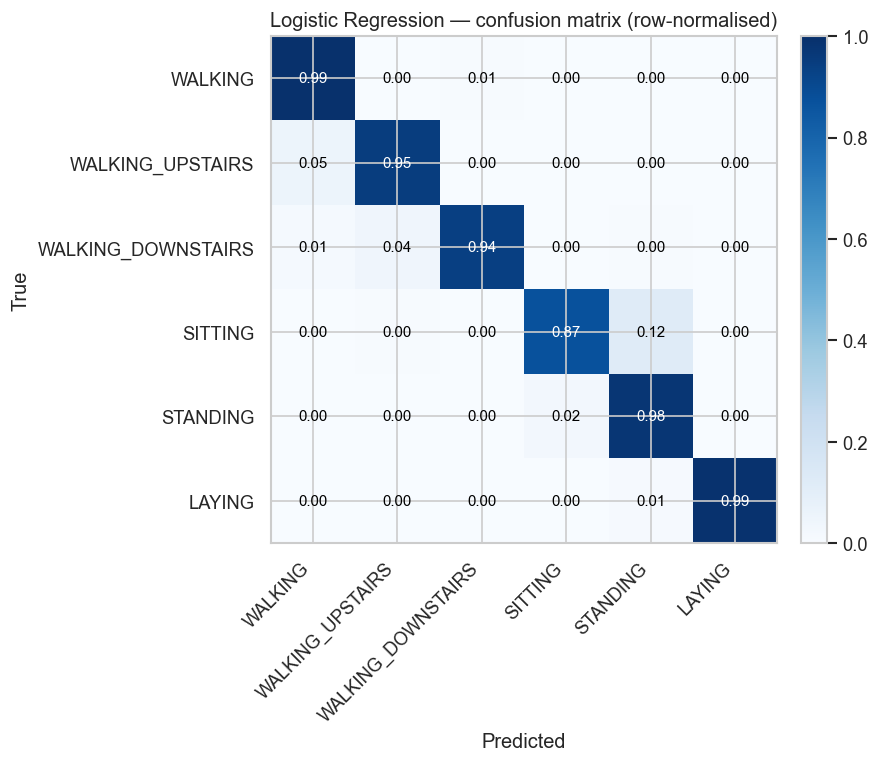
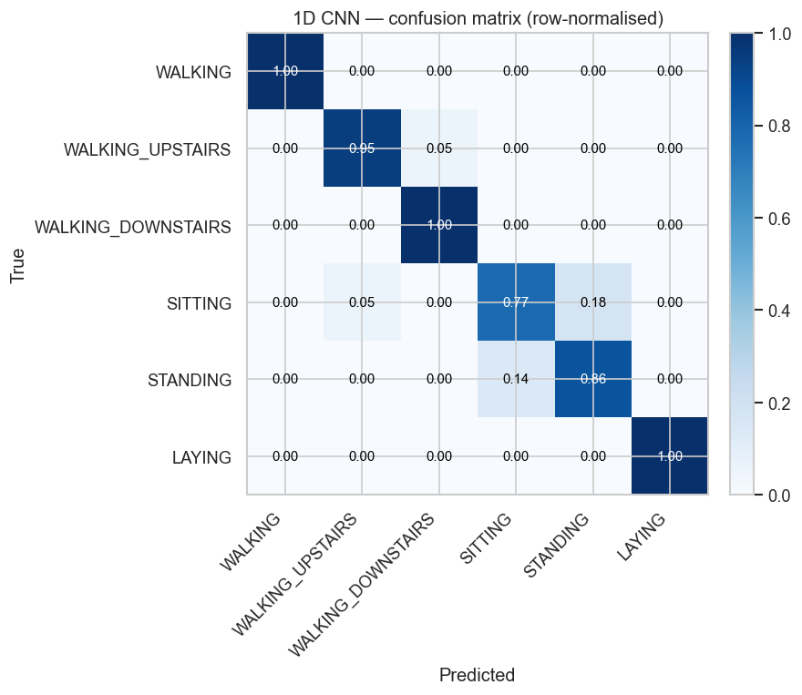

# Human Activity Recognition from Accelerometer Data

Classifying six daily activities (walking, walking upstairs, walking downstairs,
sitting, standing, laying) from wearable inertial sensor data, and comparing
classical machine learning on engineered features against deep learning on raw
signals.

The point of this project is not to hit the highest possible accuracy. It is to
evaluate models the way they would actually be used: on people the model has
never seen before. Most public HAR tutorials split windows randomly, which leaks
the same subject into both train and test and inflates accuracy. This project
keeps the dataset's built-in subject-independent split, so every result reflects
generalisation to new users.

## Background

I worked on real clinical sensor data during a research internship at EuroMov
(Digital Health in Motion), predicting real-world arm use in stroke patients
from wrist-worn accelerometers. That work made one thing clear: with sensor
data you cannot let a subject appear in both training and test, or your numbers
lie. This project applies the same evaluation discipline to a public benchmark.

## Dataset

[UCI HAR Dataset](https://archive.ics.uci.edu/dataset/240/human+activity+recognition+using+smartphones).
30 subjects wore a waist-mounted smartphone. Accelerometer and gyroscope were
recorded at 50 Hz, then segmented into 2.56 second windows (128 samples, 50%
overlap).

The data ships in two forms, and this project uses both:

| Representation      | Shape                    | Used by            |
|---------------------|--------------------------|--------------------|
| Engineered features | (n_windows, 561)         | Classical ML track |
| Raw inertial signal | (n_windows, 128, 9)      | Deep learning track|

Split (shipped with the dataset, kept intact):

| Split | Subjects | Windows |
|-------|----------|---------|
| Train | 21       | 7352    |
| Test  | 9        | 2947    |

No subject appears in both splits.

## Approach

Two tracks, and the comparison between them is the finding.

**Classical ML on engineered features**
- Logistic Regression (baseline)
- Random Forest
- Gradient Boosting
- SVM (RBF kernel)

**Deep learning on raw signal windows**
- 1D CNN
- BiLSTM

Evaluation leads with macro-F1 (the classes are imbalanced), alongside accuracy,
per-class precision and recall, and a confusion matrix.

## Results

Classical models on the official 561 features, evaluated on the 9 held-out test
subjects (none seen during training). Sorted by macro-F1.

| Model               | Accuracy | Macro-F1 | Fit time |
|---------------------|----------|----------|----------|
| Logistic Regression | 0.955    | 0.955    | ~2 s     |
| SVM (RBF)           | 0.955    | 0.954    | ~2 s     |
| Gradient Boosting   | 0.933    | 0.933    | ~34 s    |
| 1D CNN              | 0.924    | 0.925    | ~1 min   |
| Random Forest       | 0.926    | 0.924    | ~34 s    |
| BiLSTM              | 0.897    | 0.898    | ~2 min   |

On this dataset the linear model is both the most accurate and the fastest: the
561 features were engineered to make the activities close to linearly separable,
so the heavier models add nothing. The deep models, trained on the **raw** signals
with no hand-engineered features, are competitive with the tree ensembles but beat
none of the classical models — with this little data, learning features from
scratch has no headroom over features designed for the task, and costs far more
compute. (Deep-learning numbers vary by a point or two across runs and hardware.)

The one consistent error, across **every** model, is **sitting vs standing**. It
follows directly from the physics — the two postures differ only by a subtle
orientation cue — and it is only visible *because* the evaluation is
subject-independent. Two entirely different model families agreeing on what is
hard is strong evidence the ceiling is set by the data, not the model.

Classical best (Logistic Regression) vs deep best (1D CNN):




## Repository layout

```
har-accelerometer/
├── README.md
├── requirements.txt
├── data/                    # downloaded on demand, gitignored
├── src/
│   ├── data_loader.py       # download + load features and raw signals
│   ├── features.py          # custom feature extraction from raw signals
│   ├── models.py            # classical model definitions
│   ├── evaluate.py          # metrics + confusion matrix plotting
│   └── deep_models.py       # 1D CNN, BiLSTM, training loop (PyTorch)
├── notebooks/
│   ├── 01_eda.ipynb                 # class balance, signals, PCA
│   ├── 02_feature_engineering.ipynb # custom features vs the official 561
│   ├── 03_classical_models.ipynb    # four-model comparison + confusion matrix
│   └── 04_deep_learning.ipynb       # 1D CNN and BiLSTM on raw signals
├── results/
│   └── confusion_matrices/
└── report/
    └── findings.md
```

## Getting started

```bash
pip install -r requirements.txt

# Downloads the dataset (~59 MB) on first run, then prints a data summary.
python src/data_loader.py
```

The loader handles the download, unpacks the dataset (the archive ships a
zip inside a zip), and exposes two functions:

```python
from src.data_loader import load_features, load_raw_signals

X_train, y_train, subjects_train = load_features("train")   # (7352, 561)
X_raw,   y_raw,   subjects_raw   = load_raw_signals("train") # (7352, 128, 9)
```

## Status

- [x] Step 1: data foundation (loader, both representations, verified split)
- [x] Step 2: EDA and feature engineering (custom 162-feature set lands within
  ~0.6% accuracy of the official 561 on unseen subjects)
- [x] Step 3: classical models and evaluation (four models; best macro-F1 0.955;
  sitting/standing confusion confirmed)
- [x] Step 4: deep learning track (1D CNN and BiLSTM on raw signals; competitive
  with classical, same sitting/standing error — evidence the limit is the data)
- [ ] Step 5: findings write-up and README polish
